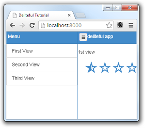
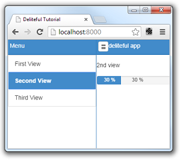
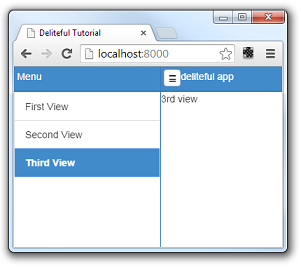

#Deliteful Tutorial (Part 2) - A Quick Look at Deliteful Components

In the [first step](Part1GettingStarted.md) of this tutorial we have setup the tools and created a first deliteful
application. Let's now go through the application source to get familiar with some deliteful components.

## HTML Markup

Let's first have a look at the HTML markup of our application.

```html
	<!-- left menu side pane -->
	<d-side-pane mode="push" position="start" id="leftPane">
	...
	</d-side-pane>
	<!-- page content -->
	<d-linear-layout class="page width100 height100">
	...
	</d-linear-layout>
```

The body contains two toplevel elements: `<d-side-pane>` and `<d-linear-layout>`. These are custom HTML elements
defined by deliteful (all deliteful components have a `d-` prefix).

Let's start with the second element. The `<d-linear-layout>` component is a container that stacks other elements
 vertically or horizontally. It is used here to build the main page of the application.

```html
	<!-- page content -->
	<d-linear-layout class="page width100 height100">
		<!-- page content header -->
		<d-linear-layout vertical="false" class="pageHeader">
			<div><button is="d-button" iconClass="icon" class="toggle" onclick="leftPane.toggle()"></button></div>
			<div class="fill titleStyle">deliteful app</div>
		</d-linear-layout>
		<!-- stacked content -->
		<d-view-stack id="vs" class="fill">
			<div id="first">
				<p>1st view</p>
				<d-star-rating value="0.5"></d-star-rating>
			</div>
			<div id="second">
				<!-- fill the second view with content -->
				<p>2nd view</p>
				<d-progress-bar value=30 max="100" essage="Uploading..." style="width: 50%"></d-progress-bar>
			</div>
			<div id="third">
				<!-- fill the third view with content -->
				<span>3rd view</span>
			</div>
		</d-view-stack>
	</d-linear-layout>
```

Note the `width100` and `height100` CSS classes on the toplevel `d-linear-layout`,
they indicate that it should fill the whole width and height of the page. These classes are defined in the
[`defaultapp.css`](/delite/docs/master/defaultapp.md) style sheet that is included by the application generator.

The toplevel `d-linear-layout` element contains two children: another nested `d-linear-layout` element,
which will be the header of the page, and a `d-view-stack` element.

The nested `d-linear-layout` element has a `vertical="false"` attribute, which means that it will stack its children
 horizontally. The children of the header are a button (nested inside a div) and another div that displays
the title text. The button has an `onclick` event listener to show/hide the side pane (see below).

The second child of the toplevel `d-linear-layout` element is a `d-view-stack` element. This is another deliteful
container that shows one of its children at time. In our default application it contains three `div`s,
one containing a deliteful `d-star-rating` element (visible on the first screen shot above),
a second one containing a deliteful `d-progress-bar` element, and a third one containing just standard HTML elements.

Let's go back to the first toplevel element of our application, the `d-side-pane` component. It is used to display
 a sliding pane on the side of a main application view. It can be seen in action by clicking the top-left icon:



The `d-side-pane` contains elements with a similar structure as the main view, with a vertical `d-linear-layout`
containing a header (a nested `d-linear-layout`), but below the header we now have a deliteful `d-list`  element. The
 `d-list` is an important deliteful component that displays a list of items.

```html
	<d-side-pane mode="push" position="start" id="leftPane">
		<d-linear-layout class="height100">
			<!-- left menu header -->
			<d-linear-layout vertical="false" class="pageHeader">
				<div class="fill titleStyle">Menu</div>
			</d-linear-layout>
			<!-- left menu content -->
			<d-list id="list" on-selection-change="vs.show(event.newValue.id)" selectionMode="radio">
				<d-list-store>
					{"label": "First View", "id": "first" },
					{"label": "Second View", "id": "second" },
					{"label": "Third View", "id": "third" }
					<!--{"label": "Fourth View", "id": "fourth" }-->
				</d-list-store>
			</d-list>
		</d-linear-layout>
	</d-side-pane>
```

Note the `on-selection-change="vs.show(event.newValue.id)"` attribute on the `d-list`. It adds a event listener so
that when an element is selected in the list, one of the children of the `d-view-stack` in the main view is shown:

 

## CSS

As usual when creating web applications, the CSS part is also very important, so you can have a look at the
`css/app.css` file which contains the CSS rules that define the layout and style of the page elements.

Note in particular that all deliteful components have a CSS class with the same name as their HTML tag, for example:

```css
.d-side-pane {
	border-right: 1px solid #357ebd;
}
```

## JavaScript

The default application contains some JavaScript code that you can often reuse to get started.

```js
		require.config({
			baseUrl: "bower_components"
		});
		require(["delite/register", "delite/theme!delite/themes/{{theme}}/global.css", "deliteful/ViewStack",
				"deliteful/SidePane", "deliteful/LinearLayout", "deliteful/Button", "deliteful/StarRating",
				"deliteful/ProgressBar", "deliteful/list/List", "requirejs-domready/domReady!"], function(register) {
			register.parse();
			document.body.style.display = "";
			list.selectedItem = list.store.get("first");
		});
```

The `require.config` calls tells the browsers where to find the various delite, deliteful and other libraries.

The `require` call loads the AMD modules containing the components used in the application.

The `register.parse()` call is necessary so that delite/deliteful widgets are correctly initialized on all browsers.

The body of the application is initially hidden by a `display: none` style. This is a well-known technique to
make sure that the DOM will not be displayed before it is fully initialized by the delite/deliteful code. The
`document.body.style.display = "";` line makes the body visible once everything is correctly setup.

##Next Step

Now that you have a basic understanding of how to create a simple deliteful application,
let's move to the [next step](Part3PhotoFeedApp.md) where we will describe the application that we will create.

[Previous Step - Getting Started with Deliteful](Part1GettingStarted.md)

[Next Step - Introducing the Photo Feed Application](Part3PhotoFeedApp.md)
