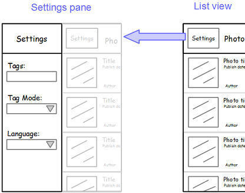
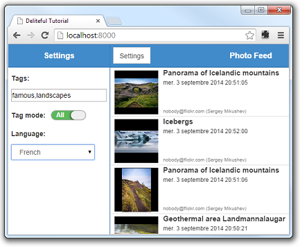

#Deliteful Tutorial (Part 7) - The Settings View

Our example app is almost complete now that we added the [details view](Part6DetailsView.md).
We will now add the last piece: a settings view which will allow the user to choose the photo tags and other options.
This will be the opportunity to see more deliteful widgets in action.

Our settings view is shown and hidden by clicking the Settings button in the header of the main view:



> If you have chosen to get the tutorial application from the `ibm-js/deliteful-tutorial` project,
switch to the `part7` tag now:

```
$ git checkout part7
```

##Markup and CSS

Our app already contains a `d-side-pane`, and it is a good fit to implement a settings view. Let's just modify its
contents:

```html
<!-- left pane (Settings) -->
<d-side-pane mode="push" position="start" id="leftPane">
    <d-linear-layout class="height100">
        <!-- left menu header -->
        <d-linear-layout vertical="false" class="pageHeader">
            <div class="fill titleStyle">Settings</div>
        </d-linear-layout>
        <d-linear-layout>
            <div class="formLabel">Tags:</div>
            <input id="tagsInput" class="formInput" onchange="tagsChanged()">
            <d-linear-layout vertical="false">
                <div class="formLabel switchLabel">Tag mode:</div>
                <d-switch id="tagModeSwitch" uncheckedLabel="Any" checkedLabel="All"
                          onchange="tagModeChanged()"></d-switch>
            </d-linear-layout>
            <div class="formLabel">Language:</div>
            <d-select id="languageSelect" onchange="languageChanged()"></d-select>
        </d-linear-layout>
    </d-linear-layout>
</d-side-pane>
```

Add this to `css/app.css` to style the side pane and its elements:

```css
.d-side-pane {
    border-right: 1px solid #357ebd;
}
.formLabel {
    font-size: 14px;
    font-weight: bold;
    margin: 12px 6px 6px 6px;
}
.formInput {
    margin: 6px;
}
.d-switch {
    height: auto;
    align-self: center;
    margin: 12px 6px 6px 6px;
}
.d-select {
    align-self: flex-start;
    margin: 6px;
}
```

##JavaScript Code

We added new elements that we did not use before in our settings view so let's first add these new AMD modules to the
require list:

```js
require([
	..., "deliteful/Select", "deliteful/Switch", ...
], ...
```

(We don't need to add corresponding argument to the require callback since we don't explicitly use these modules in
our code, we just need to have them loaded so that the delite parser can initialize them.)

Here is now the code to add to initialize the settings view and handle changes in it:

```js
	// Initial settings
	var settings = {
		tags: "famous,bridges",
		tagMode: "all",
		language: "en-us"
	}

	// Possible display languages
	var languages = [
		{text: "English", value: "en-us"},
		{text: "French", value: "fr-fr"},
		{text: "German", value: "de-de"},
		{text: "Italian", value: "it-it"},
		{text: "Korean", value: "ko-kr"},
		{text: "Portuguese (Br)", value: "pt-br"},
		{text: "Spanish", value: "es-us"},
		{text: "Trad. Chinese (HK)", value: "zh-hk"}
	];

	// Initialize elements of the settings view based on initial settings:

	tagsInput.value = settings.tags;

	tagModeSwitch.checked = settings.tagMode == "all" ? true : false;

	languages.forEach(function (l) {
		languageSelect.store.add(l);
		languageSelect.setSelected(l, l.value == settings.language);
	});

	// callbacks called when a settings input field is modified

	tagsChanged = function () {
		settings.tags = tagsInput.value;
		refreshPhotoList();
	};

	tagModeChanged = function () {
		settings.tagMode = tagModeSwitch.checked ? "all" : "any";
		refreshPhotoList();
	};

	languageChanged = function () {
		settings.language = languageSelect.value;
		refreshPhotoList();
	};
```

We define a `settings` object that contains our options. We then initialize the widgets of the settings view with
these settings. Finally, we create the callback functions that will be called when a widget value is changed by the
user. The callback functions update the settings in memory based on the new widget state.

OK, we can now modifiy slightly our existing code to use the settings properties instead of the hardcoded values that
 we had so far:

```js
    ...
	refreshPhotoList = function () {
		...
		getPhotos(settings.tags);
	};
	...
	function getPhotos(tags) {
	    ...
		var url = ... + "&tagmode=" + settings.tagMode;
		...
	}
	...
		formatDate: function (d) {
			return d && new Intl.DateTimeFormat(settings.language, {
				...
		}
	...
```

Our settings view should work now! Try it out: click the Settings button, change the "bridges" tag to "landscapes" for
example, and change the language to French:



##Run the Demo

Click here to see the live demo:
[Deliteful Tutorial - Part 7](http://ibm-js.github.io/deliteful-tutorial/runnable/part7/index.html)

##Congratulations!

You have now completed this deliteful tutorial. More documentation and examples are available on the
[deliteful web site](http://ibm-js.github.io/deliteful/index.htm).

[Previous Step - Adding a Details View](Part6DetailsView.md)
